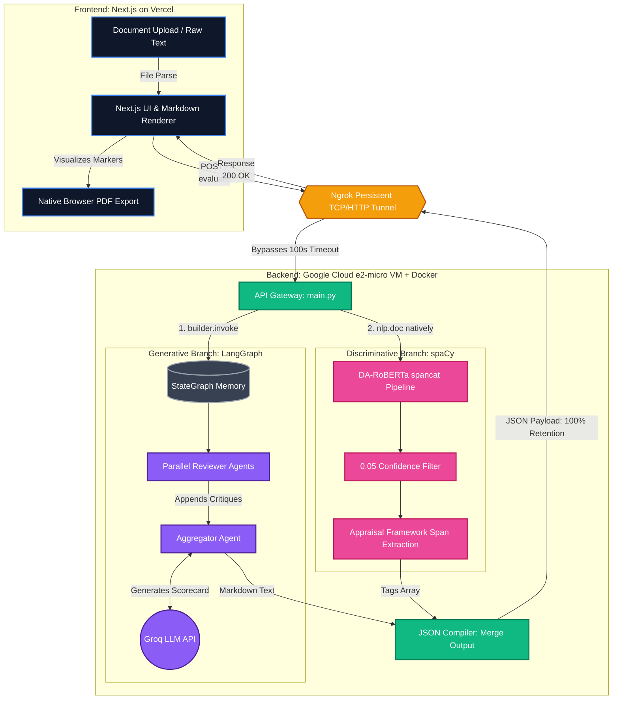

# Multi-Agent Academic Engagement Evaluator

A hybrid Natural Language Processing (NLP) pipeline designed to perform highly accurate, discourse-level rhetorical analysis of academic texts. This system combines a generative multi-agent LLM architecture with a discriminative sequence tagger to automate academic critique and extract specific Appraisal Framework discourse markers.

## Architecture

The system utilizes a bifurcated execution model across two distinct cloud environments to bypass strict hardware and timeout limitations:

1.  **Frontend (Vercel):** A Next.js React application handling dynamic document parsing (PDF, Word, TXT) and native browser PDF generation via CSS injection (`print:hidden`).
2.  **Backend (Google Cloud VM + Docker):** A FastAPI server acting as the gateway for two parallel pipelines, tunneled through a persistent Ngrok TCP/HTTP bridge to prevent Cloudflare 100-second execution timeouts on edge hardware (1GB RAM `e2-micro`).
    *   **Generative Branch:** A LangGraph state machine orchestrating parallel LLM Reviewer agents and an Aggregator agent to compile a standardized markdown scorecard.
    *   **Discriminative Branch:** A custom-trained spaCy (v3.7.5) `spancat` model executing natively at the routing layer to identify rhetorical markers across strict Appraisal Framework categories.

### Full Pipeline

## Key Engineering Achievements

*   **100% Payload Retention:** Architecturally decoupled the spaCy extraction from the LangGraph memory state to eliminate critical data-wiping race conditions during JSON compilation.
*   **Zero-Cost Edge Optimization:** Engineered the PyTorch transformer inference to execute successfully on heavily constrained free-tier hardware via custom swap-memory allocation and asynchronous tunneling.
*   **Frontend Rendering Resiliency:** Eliminated Canvas-based SVG rendering crashes (Status 500s) by hijacking the browser's native print engine for flawless PDF scorecard generation.

## Tech Stack
*   **Frontend:** Next.js, Tailwind CSS
*   **Backend:** FastAPI, Python, Docker
*   **AI/ML:** LangGraph, spaCy, PyTorch, Groq API
*   **Infrastructure:** Google Cloud Platform, Ngrok, Vercel

## Deployment
The backend runs autonomously in a detached `tmux` session with a `unless-stopped` Docker restart policy, ensuring permanent uptime and resiliency against server reboots.
